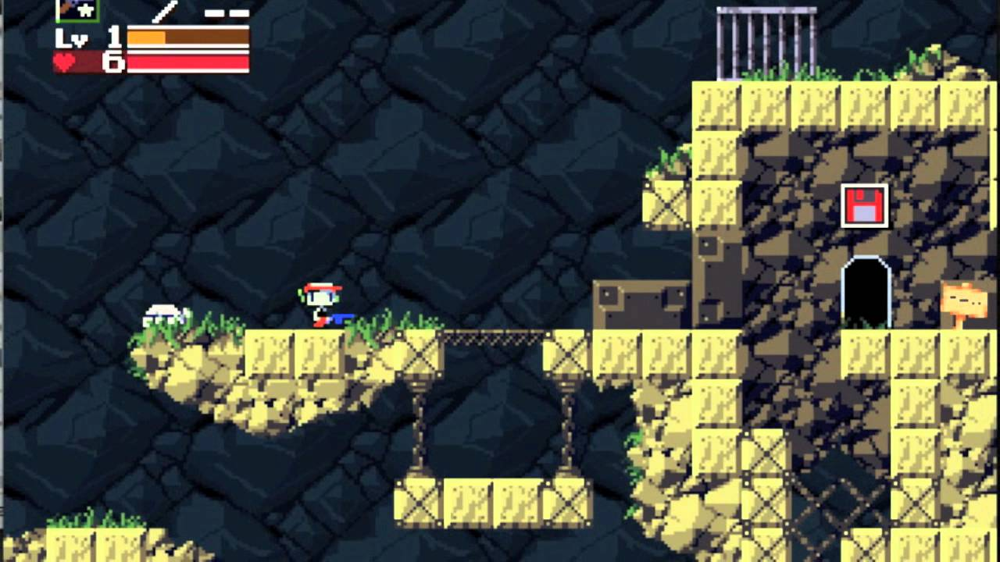
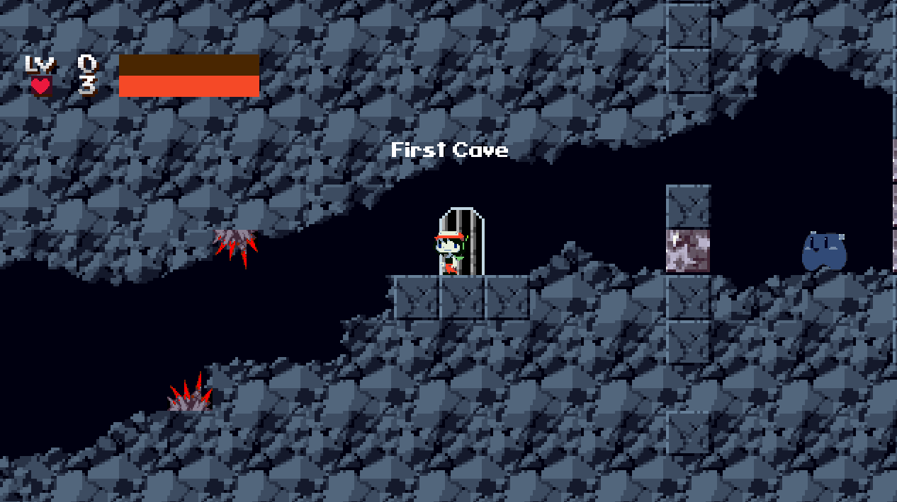
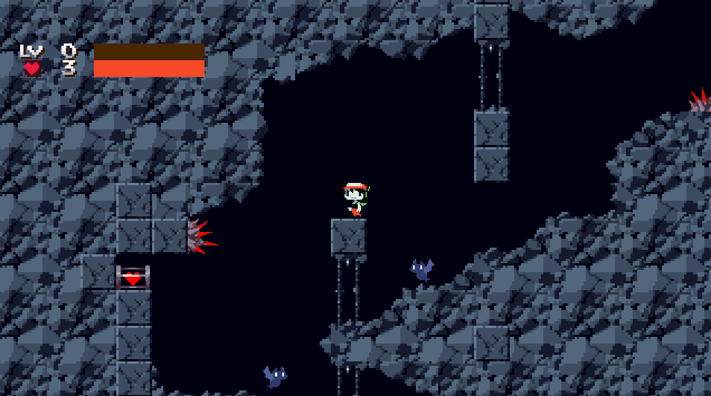
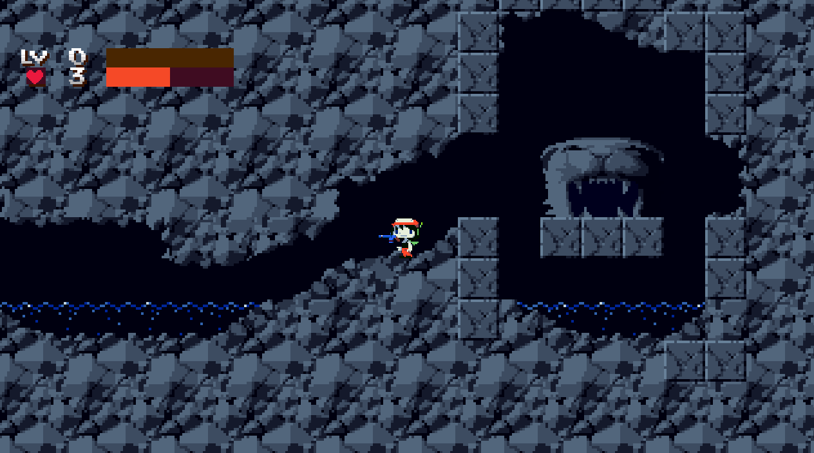
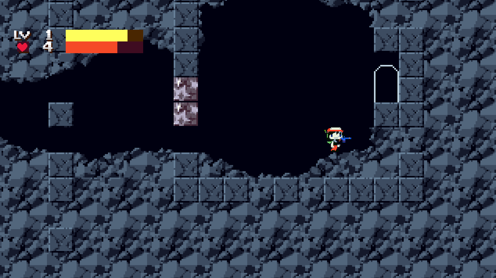
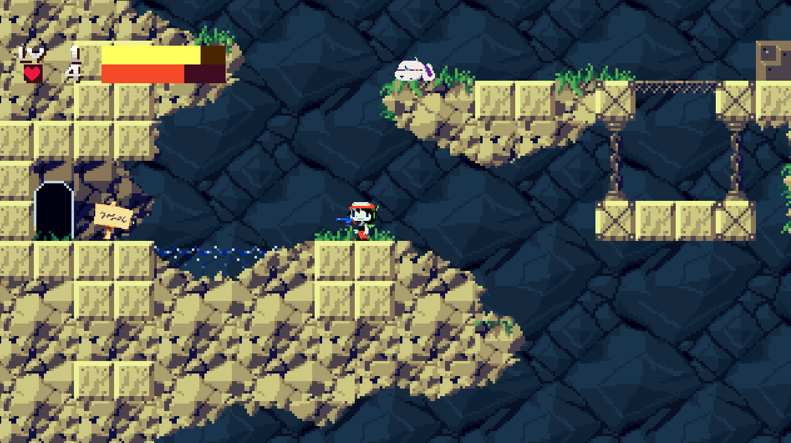

<!-- GENERAL GAME INFO -->
 

  <h2 align="center">Cave Story+</h2>

  

Cave Story+ is an enhanced commercial version of the original CaveStory.
Cave Story is a 2004 Metroidvania game. It was developed over five years by Japanese independent developer Daisuke "Pixel" Amaya in his free time. It blends tight shooting mechanics, nonlinear exploration, and multiple endings in a retro pixel-art world inspired by classic 8- and 16-bit games.
     
    <strong>Original game : </strong>
    <a href="https://en.wikipedia.org/wiki/Cave_Story#Cave_Story+"><strong>General info »</strong></a>
    ·
    <a href="https://youtu.be/el2GUSEyMGU"><strong>Youtube video »<strong></a>
     
     
  

<!-- TABLE OF CONTENTS -->

  
Table of Contents

  <ol>
    <li>
      <a href="#about-the-project">About The Project</a>
    </li>
    <li>
      <a href="#my-version">My version</a>
    </li>
    <li>
      <a href="#getting-started">Getting Started</a>
    </li>
    <li><a href="#how-to-play">How To Play</a></li>
    <li><a href="#class-structure">Class structure</a></li>
    <li><a href="#checklist">Checklist</a></li>
    <li><a href="#contact">Contact</a></li>
    <li><a href="#acknowledgments">Acknowledgments</a></li>
  </ol>

<!-- ABOUT THE PROJECT -->
## About The Project

Here's why:
* It is a remaster of a classic indie game with a passionate fanbase I somehow haven't gotten around to play earlier.
* The game high variety of worlds with lively and rich characters.
* Focused and strong core gameplay loop.
* I think it serves great for learning how to program platformers.

(<a href="#readme-top">back to top</a>)

## My version

This section gives a clear and detailed overview of which parts of the original game I planned to make.

### The minimum I will most certainly develop:
- [x] Overlay  first cave level as a texture and lay-out collision shapes.
- [x] Player with horizontal movement, jumping, and basic air control
- [x] Collision detection between player
- [x] Camera that follows player within level bounds
- [x] Rendering the player sprite and animation states (idle, run, jump)
- [X] Basic enemy entity with position and simple movement pattern
- [X] Player projectile system (spawn bullet, movement, lifetime)
- [X] Collision detection between bullets and enemies
- [X] Enemy damage, hit feedback, and removal on defeat
- [X] Player damage on enemy contact
- [X] Basic HUD showing player health
- [X] Beginning of Mimiga Village area layout
- [X] Trigger zone that stops player and opens dialog
- [X] Dialog box UI with text rendering
- [X] Input handling to advance dialog text
- [X] Camera lock during dialog events

### What I will probably make as well:
- [ ] Save station entity placed in first level
- [ ] Interaction key to activate save station
- [ ] Save system storing player position and health
- [X] Boss entity with larger sprite
- [X] Boss attack patterns (movement phases)
- [X] Boss health display
- [x] Boss defeat event triggering dialog or transition
- [X] Transition between cave level and Mimiga Village
- [X] NPC entity system for characters in village
- [X] NPC interaction trigger and dialog events

### What I plan to create if I have enough time left:
- [ ] Smaller details like particles
- [ ] Full Mimiga Village map layout
- [x] Multiple NPCs with multiple dialog lines

(<a href="#readme-top">back to top</a>)

<!-- GETTING STARTED -->
## Getting Started

### Prerequisites

* Visual Studio 2022
* "Desktop development with C++" workload installed through Visual Studio Installer

### How to run the project

The game project is called CaveStoryPlus, right click it and set as "Set as Startup Project".
If not already: ensure that CaveStoryPlus has the Engine project set as a project build dependency.

(<a href="#readme-top">back to top</a>)

<!-- HOW TO PLAY -->
## How to play

You start of in the Cave level. Use the arrow keys and Z to move to the left side of the screen.
Make sure to avoid the various spikes and enemies!

{ width=75% }

On the left you will see a Life Capsule. You can pick it up by pressing arrow Down.
Then press X to read through the dialog message.

{ width=75% }

On the bottom right of the map you will find the Gunsmith building where you can collect the Polar Star gun.

{ width=75% }

Make your way to the top-right of the level, after defeating 
the enemies in your way you can go throught he door to the next level.

{ width=75% }

In the second level: you have access to the Reservoir on
the left and the Boss Room on the far bottom right.
There are NPCs and objects to interact with.

{ width=75% }

### Controls

* Left and Right arrow keys to move around.
* Down arrow to interact with NPC, objects and going through doors.
* Z key to Jump.
* X key to shoot and read through dialog.

(<a href="#readme-top">back to top</a>)

<!-- CLASS STRUCTURE -->
## Class structure 

### Object composition 
The **Player** object owns a pointer to child class object of **Weapon** and its **Texture**sheet.
The **Player** class also has non-owning reference to the **DialogManager**, **SoundManager** =.
but does own a **PlayerGUI** object.

An object of **Level** class contains a non owning pointer to the **SpriteSheetManager**.
It also owns a **BulletManager** among various **std::vector**s containing objects in the game.

A **BossEnemy** object holds a **BarWidget** as a field or component.

### Inheritance 
All interactable things in the game inherit from the base abstract class **Interactable**:
for example **DoorInteractable**, **GoldInteractable** and **ChestInteractable**.

There is also a **DecorInteractable** class that provides shared code for its children classes (NPCs).

The **DialogEvent** abstract base class is inherited by a lot of classes:
(**GiveHealthDialogEvent**, **RespawnDialogEvent**, **SpawnBossDialogEvent**, ...)  to allow logic to
happen whenever the player read through a certain **DialogMessage**.

### Managers
There are many managers that handle the different systems of the game,
like: **BulletManager**, **SpriteSheetManager**, **SoundManager**, **MusicManager**, **DialogManager**, ...

(<a href="#readme-top">back to top</a>)

<!-- CHECKLIST -->
## Checklist

- [x] Accept / set up github project
- [x] week 01 topics applied
    - [x] const keyword applied proactively (variables, functions,..)
    - [x] static keyword applied proactively (class variables, static functions,..)
    - [x] object composition (optional)
- [x] week 02 topics applied
    - [x] Use of transformations: *BossEnemy, Bullet, Camera, PolarStar*
    - [x] Use of Manager classes: *BulletManager, TextManager, DialogManager, ...* 
- [x] week 03 topics applied
    - [X] Apply OO principles: Data members, Accessors, Mutators, Behavior
    - [X] Seperate .h from implementation .cpp
    - [X] Classes with constructors to prevent invariant states.
- [X] week 04 topics applied
    - [X] Use of class forwarding in headers when possible over including headers. Prevent cylic dependencies with forward declaration.
    - [X] object composition
    - [X] Implementation of platforms. Collision between player and platforms.
- [x] week 05 topics applied
    - [x] Single responsibility principle
    - [x] Class relationships: composition, aggregation, association, inheritance
    - [x] Delegating constructors to avoid duplicate code (see **Interactable** .cpp file)
    - [X] Use of inheritance (see Class structure above)
- [x] week 06 topics applied
    - [x] Polymorphism
    - [x] C++ style casting (used static_cast)
    - [X] Use of (pure) virtual (see **Interactable** class)
    - [x] Camera (object space, world space, camera space)
    - [x] Sound
    - [x] Music
- [x] week 07 topics applied
    - [x] friend keyword (see **Level** class)
    - [x] operator overloading (see **Level** class)
    - [x] use explicit keyword for constructors
- [x] week 08 topics applied
    - [x] Copy semantics, Rule of 3
- [x] week 09 topics applied
    - [x] prevent object slicing
    - [x] use lvalue reference when needed
- [x] week 10 topics applied
    - [x] Move semantics, Rule of 5 
- [x] week 11 topics applied (optional)
    - [x] Streams 

(<a href="#readme-top">back to top</a>)

<!-- CONTACT -->
## Contact

Bram Deraeve - bram.deraeve@student.howest.be

Project Link: [https://github.com/HowestDAE/gd25-bramderaeve](https://github.com/HowestDAE/gd25-bramderaeve)

(<a href="#readme-top">back to top</a>)

<!-- ACKNOWLEDGMENTS -->
## Acknowledgments

* [Cave Story Wiki: Textures of the entire levels](https://cavestory.fandom.com/wiki/Mimiga_Village)
* [My favourite animation trick: exponential smoothing](https://lisyarus.github.io/blog/posts/exponential-smoothing.html)
* [Cave Story Font as TrueType font](https://fontlibrary.org/en/font/cave-story)
* All other game assets are ripped from CaveStory+ and CaveStory.
* [std::queue (FIFO container)](https://en.cppreference.com/cpp/container/queue)
* [std::string find](https://en.cppreference.com/cpp/string/basic_string/find)
* [std::string substr](https://en.cppreference.com/cpp/string/basic_string/substr)
* [std::vector insert](https://en.cppreference.com/cpp/container/vector/insert)
* [std::vector erase](https://en.cppreference.com/cpp/container/vector/erase)
* [std::quoted](https://en.cppreference.com/cpp/io/manip/quoted)

(<a href="#readme-top">back to top</a>)

